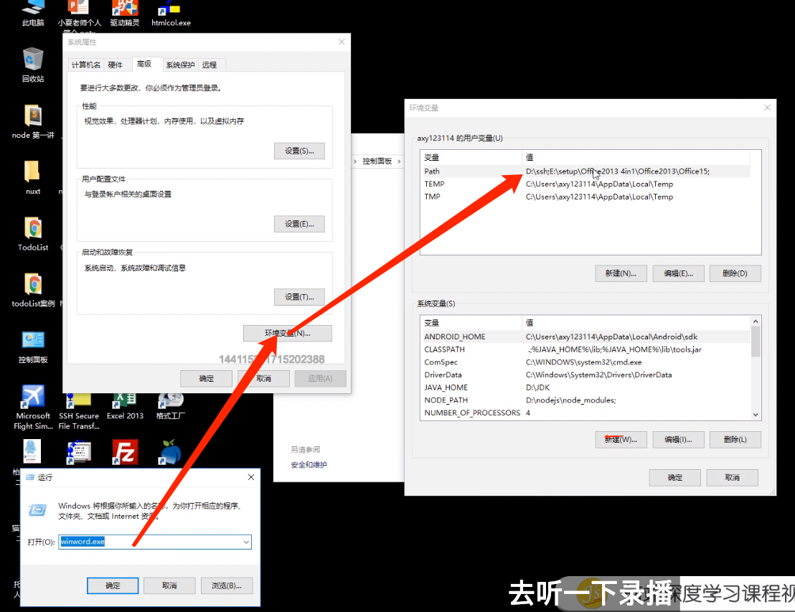

## NodeJS 的安装

到官网下载稳定版本！

打开 Node 控制台：node

可以在这里面写代码了！

查看 Node 版本：node -v

npm 时 Node 自带的包管理工具

## 环境变量

JS 中的环境变量，针对 JS 内部

环境变量就是电脑的操作系统，类似 JS 的全局变量 widnow

我我们在电脑上双击（快捷方式）应用程序图标的时候，电脑系统会帮我们去找这个应用程序的位置，例如 .exe

环境变量分类：

    用户变量：一个系统又好几个用户，用户下的全局变量

    系统变量：每个用户都可以访问的全局变量

有些软件安装后会默认在系统变量新增了一个变量，例如当 NodeJS 安装后，会安装在系统变量中。

## linux 命令

切换目录 cd ../ 
        cd dirname
用户目录 cd ～ 
根目录 cd /
新建文件 touch file.js
新增文件夹 mkdir dirname
删除文件 rm file
删除文件夹 rm -r dirname

