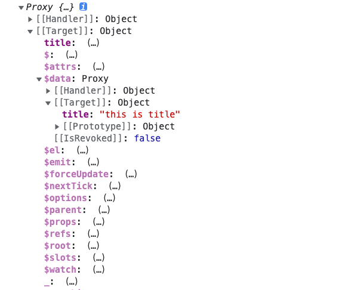
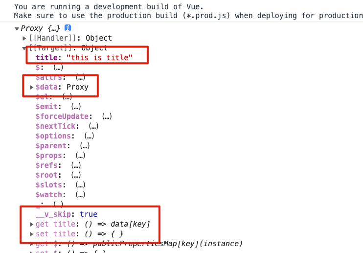

## data 响应式对象

data 必须是一个函数

Vue 在创建实例的过程中调用 data 函数，返回数据对象，并且通过响应式进行包装后存储到实例对的 $data 属性中

并且实例可以直接越过 $data 访问数据线

```js
const { createApp } = window.Vue;

const app = Vue.createApp({
  template: `
      <h1>{{ title }}</h1>
    `,
  data() {
    return {
      title: "this is title",
    };
  },
});

const vm = app.mount("#app");
console.log(vm.title);
```





vm.$data.title 和 vm.title 指向同一个数据引用

如果你直接给实例新增属性，并不会新增到 $data 中，$data 对是响应式数据对象

```js
vm.author = "xiechen";
```

vm 上的属性以 $ \_ 开头的属性都是内置的 API，开发者尽量避免用这些前缀命名自己的变量和方法名

## data 为什么必须要是一个函数？

要确保每个实例数据的引用都是独一无二的！！！

```js
function VueTest(options) {
  this.$data = options.data;
  var _this = this;

  for (const key in this.$data) {
    (function (k) {
      Object.defineProperty(_this, k, {
        get: function () {
          return _this.$data[k];
        },
        set: function (newValue) {
          _this.$data[k] = newValue;
        },
      });
    })(key);
  }
}

var data = {
  a: 1,
  b: 2,
};

var vm1 = new VueTest({
  data: data,
});
var vm2 = new VueTest({
  data: data,
});

vm1.b = 3;
console.log(vm1);
console.log(vm2);
```

这就导致了两个实例对象，数据会被同步更改
