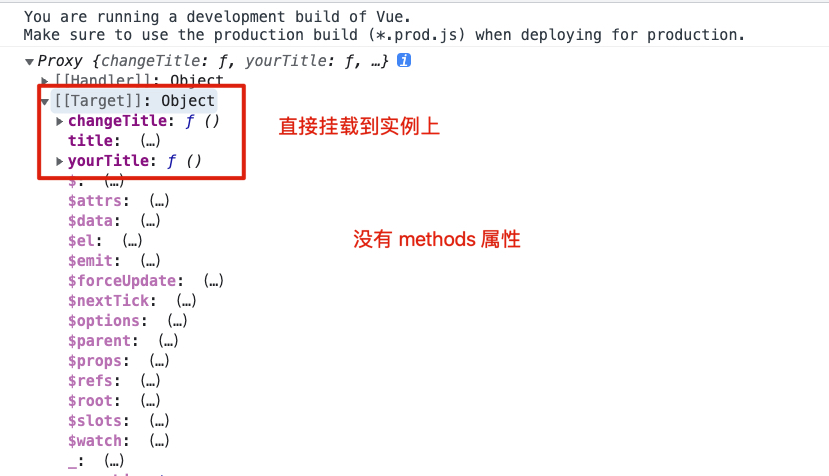

## methods

作用：向组件实例添加方法

Vue 创建实例时会自动为 methods 绑定当前实例 this，然后包装在事件监听的时候回调始终指向当前组件实例，方法要避免使用箭头函数，箭头函数会影响 Vue 正确指向 Vue 组件实例 this

```js
let app = {
  template: `
    <h1>{{ title }}</h1>
    <button v-on:click="changeTitle('title')">change title</button>
  `,
  data() {
    return {
      title: "This is my title.",
    };
  },
  methods: {
    changeTitle() {
      this.title = "This is your title.";
    },
  },
};
```

函数名 + () 不是执行符号，传入的是实参的容器，解析为 onclick = "()=> changeTitle('title')"

```html
<button v-on:click="changeTitle('title')">change title</button>
```

methods 方法可以在视图中直接被调用，模版直接调用方法要尽量避免副作用操作（更改数据、异步操作）

```html
<h2>{{ yourTitle() }}</h2>
```

实例中直接挂载 methods 中的每一个方法，并且没有抛出 methods.

为什么？

data 被更改的时候，$data 也要被更改，所以必须要暴露

methods 本身就是一些方法，直接挂载到实例上，本身没必要暴露，methods 本身就是一个链接的容器，实际上编译的过程中，methods 不会被暴露



## lodash

常用的 JS 工具库