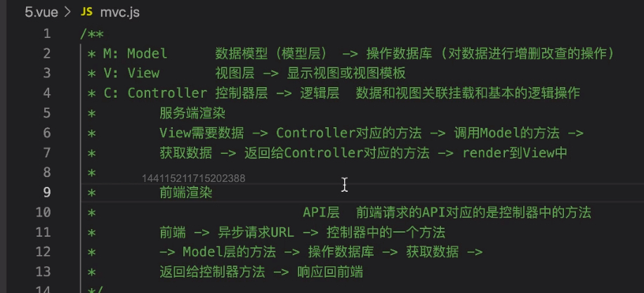

## 认识以及实现 MVC

MVC 的概念是从后端开发引入的

Model：数据模型层，对数据进行增删改查的操作，操作数据库

View：视图层，显示视图或者视图模版

Controller：控制器层，逻辑层主要将数据和视图进行关联挂载，和基本的逻辑操作；API 层，前端请求的接口对应的是 Controller 层的方法，然后去拿数据，返回给 Controller，Controller 再返回到前端。

前端（View） =》发起请求 =》Controller 的某个方法 =》 Model 层方法，操作数据库 =》返回到 Controller =》返回给前端

如果后端有 view 层那这就是服务端渲染，由后端渲染完成后返回到前端。

## 前端的 MVC

Model 管理视图需要的数据，数据与视图的关联

View HTML 模版、视图渲染

Controller 管理事件逻辑

详见：实现加减乘除的计算器案例！！！

---

MVC：数据的管理、视图的管理和事件触发的管理分层 3 个部分，分别去维护，数据变更后 Model 去调用 View 方法更新视图，View 在渲染的时候是不关心数据的变更的。

Controller =》Model（数据劫持）=》view

<!-- 

缺点：横向切割的比较好，驱动不明显，view 本该是视图层却里面包含 reander

MVC 是 MVVM 模型的雏形，MVVM 解决了驱动不内聚的缺点

 -->

我们希望后面有一套驱动，能把数据、视图、事件处理都放在一起集中，这就是 ViewModel

M 管理 data =》通过 ViewModel 进行连接 =》V 管理视图

开发者只管 MV 就可以了，Vue 是关注于视图渲染的。

Vue 容许通过 Ref 直接操作 View，所以 Vue 并没有完全遵循 MVVM 的模型，MVVM 是强制 M 和 V 是完全分离的！
