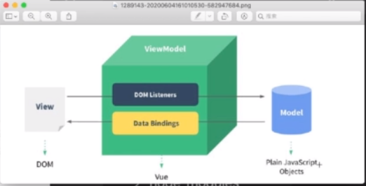

## 认识和实现MVVM轮子

MVC:

缺点：驱动被 MVC 分离成 3 部分，这样和普通的 M 和 V 的逻辑混合在一起了

MVVM：

- 驱动：ViewModel

- View：视图层

- Model：数据保存和处理

---

App.js 视图和数据

mvvm/index 数据驱动

我们只负责视图、数据、逻辑，剩下的全部由 mvvm 去驱动管理

mvvm 负责对事情：

    1、创建响应式数据

    2、对事件、数据进行编译

    3、进行渲染、更新视图

App.js 只负责模版的组织