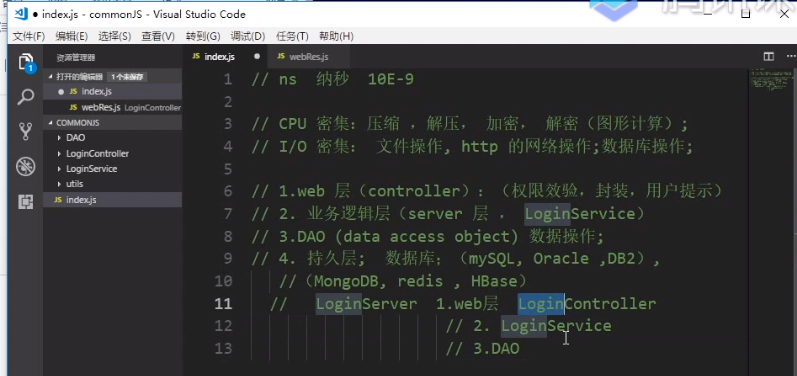
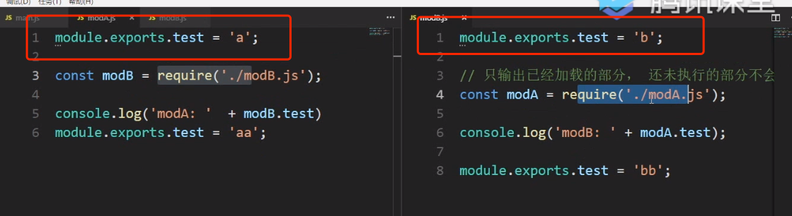

## 后端的分层

ASP：HTML + VBScript

JSP：HTML + JAVA

PHP：HTML + PHP

Ajax 的出现实现了前后端分层，通过 Ajax 实现请求。

<br>
<br>

后端目前的分层：

1、WEB 层（Controller），用户的权限校验、封装、用户提示

2、服务层或业务逻辑层（Server），处理后端集体的业务

3、DAO 层（Data Access Object），数据录入数据库

4、持久层，数据库

    关系型：mySQL、Oracle、DB2

    非关系型：MongDB



## 模块化规范 CommonJS

CommonJS 规范：

1、一个文件就是一个模块(类似一个函数)，拥有自己单独的作用域

2、普通方式定义的变量、函数都要在模块内

3、使用 require() 加载模块

4、使用 exports 或者 module.exports 导出

<br>
<br>

NodeJS 对象没有 window 对象，而是 global 对象

JS 中 var a = 10; 相当于 window.a = 10;

NodeJS 中 var a = 10; 不会添加到 global 中，所以 global.a 返回 undefined

这是因为相当于 var a = 10; 只存在于文件模块内（类似在函数内声明了 var a = 10;）

## Node

1、node filename，执行文件

2、node，进入 REPL(Read Eval Print Loop) 交互式解释器，按下 control + C 退出

<br>
<br>

Node 中的模块分两类：

1、Node 模块（也称为「核心模块」），例如：http、fs 等

    require("fs");

    不需要具体路径，直接写模块命，因为 Node 模块在编译的过程中已经被加载到内存当中，所以可以忽略路径名。

    当不加路径的时候，Node 会把文件当作 Node 的模块，如 require("index") 会抛出错误。

2、用户自己写的模块

    require("./index");

    / 表示根目录（绝对路径）

    ./ 表示当前目录（相对路径）

    ../ 表示上一级目录（相对路径）

## require()

1、require() 中不写后缀名时加载模块的规则：

    1、先补全 .js

    2、再补全 .json

    3、再找 .node

    4、以上都找不到抛出异常

2、require 的特征

    1、具有缓存，例如 require("./index.js");  require("./index.js"); 的时候只会打印一次内部的 console.log("this is index.js")

    2、require() 引入一个模块的时候类似于调用一个函数的执行，函数内部的变量是无法拿到的，需要使用 export 导出（这有点类似函数内的 return）

    3、require() 引入的是 export 导出的值

    4、循环引用的时候，只会输出已加载的部分，还没执行的部分不会输出



    结果是 "a" "bb"

## npm

1、使用别人写好的模块需要使用 npm 进行安装，安装后会产生一个 node_modules 的文件目录

2、使用的时候需要 let chalk = require("chalk");

3、引入模块解析过程：

    1、先找 node_modules 文件夹

    2、再找 node_modules/chalk 文件夹

    3、再找 node_modules/chalk/package.json 文件

    4、在 package.json 文件里找 main 属性，为入口文件

    5、如果 package.json 中没有 main 属性，则默认找 node_modules/chalk/index.js 文件为入口文件（按照 index.js/.json/.node）

    6、如果还是找不到就会从当前目录往上找

```js
paths: [
  "/Users/xiechen/Documents/code-personal/JSPlusPlus/日常学习/NodeJS基础篇/node_modules",
  "/Users/xiechen/Documents/code-personal/JSPlusPlus/日常学习/node_modules",
  "/Users/xiechen/Documents/code-personal/JSPlusPlus/node_modules",
  "/Users/xiechen/Documents/code-personal/node_modules",
  "/Users/xiechen/Documents/node_modules",
  "/Users/xiechen/node_modules",
  "/Users/node_modules",
  "/node_modules",
];
```

    7、如果还是找不到就会抛出异常

    8、我明明就装了一个 chalk 模块，为什么会有一堆其他的模块呢？这是 chalk 模块所依赖的模块，也一并给我们进行了安装，也可能存在依赖的依赖（package.json 里面的 devDependencies 和 dependencies 属性）

之前的 node_modules 的依赖是这样滴（形如）

```js
'node_modules': {
    'module': 'chalk',
    'node_modules': {
        'module': 'has-flag'
        'node_modules': {//...}
    }
}
```

如今 node_modules 做了优化，不再进行嵌套而是放在平级了

```js
'node_modules': {
    'module': 'chalk',
    'module': 'has-flag'
    // ...
}
```

## module.export

module.exports 意味着导出

同时也可以使用 exports 直接导出

```js
exports.a = 200;
```

exports 是 module.exports 对象的引用，相当于快捷方式可以少写几个字母

<br>
<br>

注意：

```js
exports = { a:10 }; // 这里赋值后不再指向 module.exports，所以这样的情况下其他文件是无法拿到 exports 导出的值的

module.exports = { a:10 }
```


