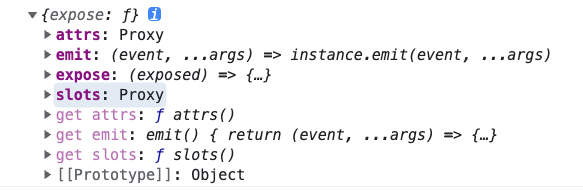

## setup

setup 运行在 beforeMount 之前，组件的初始化函数，内部没有 this

- 组合式 API 的入口函数，所有组合式 API 都可以放到 setup 内进行执行
- 它在组件被创建之前（beforeCreate）， 到 props 被解析之后执行（created）
- 所以使用组合式 API 时，没有 beforeCreate 和 created 生命周期函数
- 在组件创建之前自动执行！

```js
export default {
  setup() {}
};
```

## setup 函数的参数

props 就是 optionsApi 中 props 的引用

context 里面是一些原本 this 上的东西，

    attrs=>this.$attrs

    slot=>this.$slots

    emit=>this.$emit

    expose=> 暴露属性给父组件



```js
export default {
  setup(props, context) {}
};
```

props 是一个响应式数据，它的数据不能进行解构，这样回丢失响应式！！！

```js
export default {
  setup(props, context) {
    // 丢失响应式，详细看案例
    const { title, content } = props;

    const myContent = computed(() => {
      return "Content：" + content;
    });
  }
};
```

可以使用 toRefs 把 props 所有的属性都变成响应式

```js
const { content } = toRefs(props);
const _content = toRef(props, content); // 利用 toRef 把单个属性转换为响应式
const myContent = computed(() => {
  return "Content：" + content.value;
});
```

context 对象

```js
setup(props, context) {
    console.log(context)
    const { attrs, emit, expose, slots } = context;
    // this.$attrs: 非 prop 的 attributes
    // this.$emit
    // this.$slots
  }
```

context 对象内部的属性都是非响应式的，所以你可以安全放心的进行解构

attrs 和 slots 都是有状态的对象，它们总是会随着组件自身的更新而更新。这意味着你应当避免解构它们，并始终通过 attrs.x 或 slots.x 的形式使用其中的属性。

setup() 自身并不含对组件实例的访问权，即在 setup() 中访问 this 会是 undefined。你可以在选项式 API 中访问组合式 API 暴露的值，但反过来则不行。

为什么无法使用 this？

setup 是组件创建之前执行，执行期没有 this