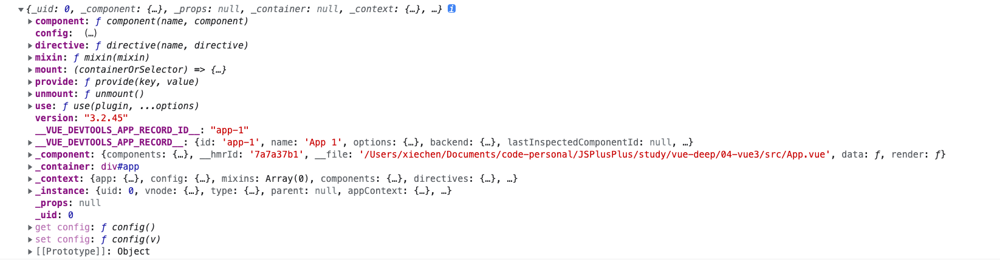
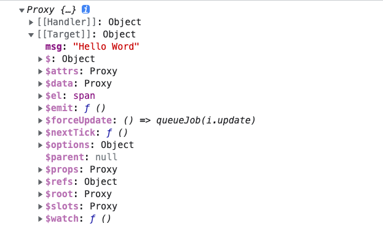

## 应用实例、组件实例与根组件实例

Vue 通过 createApp》创建 APP》返回一个应用实例

```js
import { createApp } from "vue";
import App from "./App.vue";

const app = createApp(App);
console.log(app);

// Vue2 通过实例化 Vue 进行创建应用实例
import Vue from "vue";
const app = new Vue({
  // 一些配置
});
```



应用实例主要用来注册全局的组件

```js
import TodoList from "./components/TodoList.vue";

app.component("TodoList", TodoList);
```

在 app 实例对象上，暴露了很多的方法，例如：component 注册组件、directive 注册指令、use 注册插件...

大多数方法都会返回 creatApp 创建出来的应用实例。

```js
const app = createApp(App);
console.log(app);

const res = app.component("TodoList", TodoList);
console.log(app === res); // true

// 所以可以进行链式调用
app.mount("#app");
```

## 根组件

根组件的本质就是一个对象 {}，createApp 执行的时候需要一个根组件，所以必须放一个对象

根组件是 Vue 渲染的起点！！！类比 HTML 文档的 html 标签，文档必须要有一个根标签

根元素是一个 HTML 的元素，createApp 执行创建 Vue 应用实例时需要一个 html 的根元素进行挂载渲染

```html
<!-- index.html -->
<body>
  <div id="app"></div>
</body>
```

```js
import { createApp } from "vue";
import App from "./App.vue";

// 进行挂载
createApp(App).mount("#app");
```

mount 方法执行后返回的是「根组件」实例，并不是「应用实例」！！！也就是 App 组件实例。

```js
const app = createApp(App);
const vm = app.mount("#app");

console.log(vm);
```



vm 是 ViewModel 的简称，来源于 MVVM 模式，Vue 并不是一个完整的 MVVM 模型，他只是参考了 MVVM 模型。

## 组件实例

每个组件都有自己的组件实例，一个应用中虽所有的组件都共享一个应用实例，也就说 app ！！

无论是根组件还是应用内其他组件，配置选项、组件的行为（生命周期函数）都是一样的。

```js
const component = {
  template: "<span>{{ msg }}</span>",
  data() {
    return {
      msg: "Hello Word",
    };
  },
  mounted() {},
};
```

一个组件实例可以添加一些属性，如 data/props/components/methods...

this.$attrs/$emit 都是 Vue 组件实例内置的方法

## 生命周期

组件是有一个初始化过程的，在这个过程中，Vue 提供了很多每个阶段运行的函数，这就是生命周期。

生命周期会在对应的初始化阶段自动运行。

```js
export default {
  data() {
    return {
      msg: "Hello Word",
    };
  },
  /**
   * 初始化事件、生命周期
   *
   *  */
  // 创建组件之前：
  beforeCreate() {},
  /**
   * 初始化注入、响应式
   *  */
  // 组件创建完成
  created() {},
  /**
   * 是否有 template?
   * yes：生成 AST 数据树=>生成虚拟 DOM=>编译模版到渲染函数
   * no：编译 el 的 innerHTML 到模版
   * */
  // 挂载之前
  beforeMount() {},
  /**
   * 创建 app.$el,并添加到 el
   *
   *  */
  // 挂载完成
  mounted() {},
  // 数据更新之前
  beforeUpdate() {},
  /**
   * 虚拟 DOM 重写渲染和更新
   *
   */
  // 数据已更新
  updated() {},
  // 组件销毁之前
  beforeUnmount() {},
  // 组件已销毁
  beforeMount() {},
};
```

虚拟DOM：为了能够能高效的更新 DOM 的渲染。