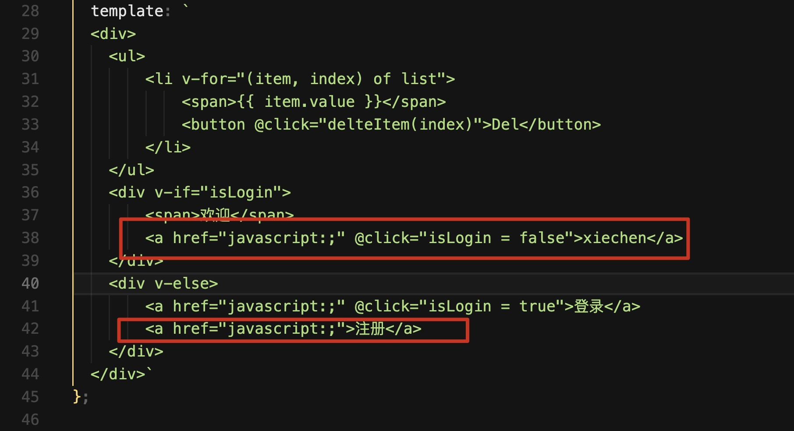
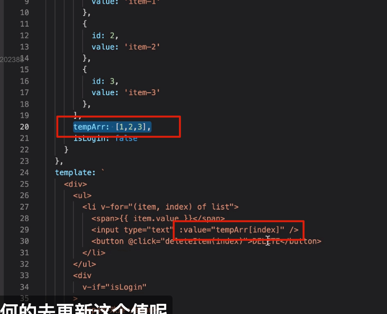
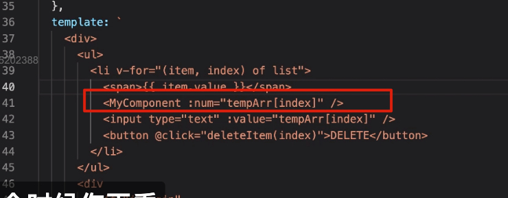

# Vue的就地更新与v-for的key属性

基于 Vue2 的版本

删除第二个 li 的时候，第二个 li 会闪，也就说 li 发生了变化

详见视频

当我点击 item-2 时：删除 item-3 的 li ，实际上是将 item-3 移到原来 item-2 的位置，然后再删除 item-3 的 li 元素

这就是就地更新策略，就地：当前操作的项目进行更新且删除最后一项

## 就地更新的好处

两个模块里都有 a 标签，按照我们的理解当条件发生变化的时候，div 都会重新渲染，实际上 Vue 会进行就地更新策略。

（只有内容发生变化的时候，标签才会变紫色），详见视频

## 就地更新的问题

到了 v-for 就有问题了。

文本框输入数字后进行删除，第二项的数据变成了 2 （详见视频）

这是因为 input 是一个临时状态，Vue 无法判断节点的 value 到底有什么用

同样无变化，这是因为 tempArr 是无变化的

这种情况下，我们就要给元素绑定一个 key 属性，让 Vue 能够清楚的定义到元素

key 必须是唯一的，不可变的

当数据更新时候，Vue 通过 key 属性去确认元素，同时确认元素的子元素

## 参考

- https://segmentfault.com/a/1190000042415654?sort=newest

- https://juejin.cn/post/6872271674692075534

- https://juejin.cn/post/6989647768411176968

- https://cn.vuejs.org/api/built-in-special-attributes.html#key