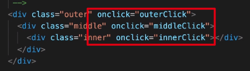

## 事件修饰符

### .prevent 

阻止事件默认行为

目的在于把「事件处理函数」中非纯逻辑的程序分离出去。

```js
  methods: {
    onSubmit(e) {
      // 事件处理相关的程序是非纯逻辑的，onSubmit 内应该只负责纯逻辑的，例如更改数据
      // 希望你把非纯逻辑的代码分离出去
      // e.preventDefault()
      console.log(123);
    }
  }
```

### .once

调用一次事件处理，调用一次事件后自动移除监听器

```html
<button @click.once="doOnce">Once</button>
```

### .stop 

阻止事件冒泡

### .capture

采用事件捕获

### .self

跳过非事件源的事件触发

### .passive 

永远不调用 Event.preventDefault()

和 .prevent 不能同时使用，例如 @click.prevent.passive = "handler"

### 事件修饰符顺序

事件修饰符联用的时候要注意顺序问题，Vue 是按照顺序进行执行的。

## 键盘修饰符

## 为什么在 HTML 中监听事件？

在视图中绑定了逻辑，我们希望视图和逻辑完全分离

Vue 的事件是在视图上进行绑定的



