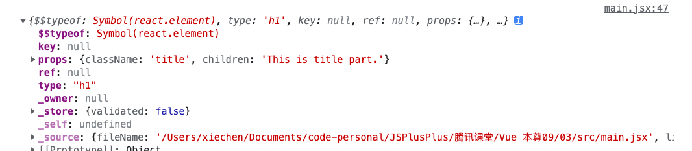

# 结合 react 深度学习 JSX

## JSX 到底是什么？

1、是一种标签语法，是在 JS 上进行语法拓展（既有 HTML 的表象，又有 JS 的逻辑）

2、不是字符串，也不是 HTML 标签

3、是描述 UI 呈现与交互的直观形式

4、会生成 React 的元素，类似 creatElement

## creatElement 和 JSX 对比？

```js
// 方法1
cosnt rEl = React.createElement('h1', { className: 'title' }, "This is my first JSX experience.")

// 方法2
const rEl = (
  <h1 className="title">
    This is my first JSX experience.
  </h1>
);
ReactDOM.render(rEl, document.getElementById('app')))
```

JSX 遵循 JS 的命名规范，一般使用 camelCase 小驼峰命名

class => className

tabindex => tabIndex

## 为什么 React 不把视图标记和逻辑分开呢？

1、渲染和 UI 标记是有逻辑耦合的，我的视图是需要大量的数据，或事件，如果分开就会不清晰，还需要到另外的文件去寻找，过于复杂，所以 Vue 和 React 都是为了更直观的体现出视图、数据、和事件。

2、即使是这样的耦合也能实现关注点分离，因为在 render 函数返回视图，实际上某一个角度来说，视图和数据是分离的。

## JSX 的插值表达式

表达式：一切有效的（符合JS逻辑的）表达式，都写在 `{}` 里面，例如 `{ title }`

JSX 有一个编译的过程，被编译后 JSX 会转换为 React 元素，实际上就是一个普通的对象

```js
const rEl = <h1 className="title">This is title part.</h1>
console.log(rEl)
```




可以通过 React.createElement 来创建一个 React 元素

```js
const rEl = <h1 className="title">This is title part.</h1>
const rEl2 = React.createElement("h1", { className:"ttile"}, 'This is title part.')
console.log(rEl)
console.log(rEl2)
```

以上两个是相同的，但是 rEl 是需要经过编译后才会转换为 React 元素，而 rEl2 直接执行就会返回 React 元素。

## render 之前

所有的JSX都会转换为字符串，然后进行分析，形成 React 元素

所有的输入的内容（插入的内容）都会进行转义（XSS攻击，不太容易实现，因为内容会被解析）