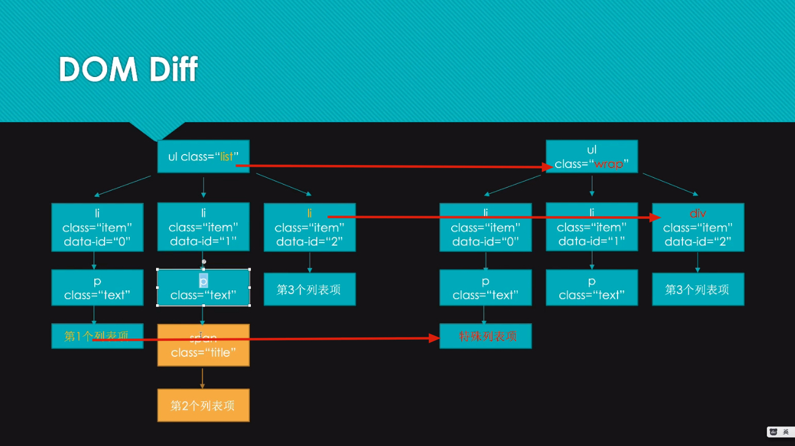
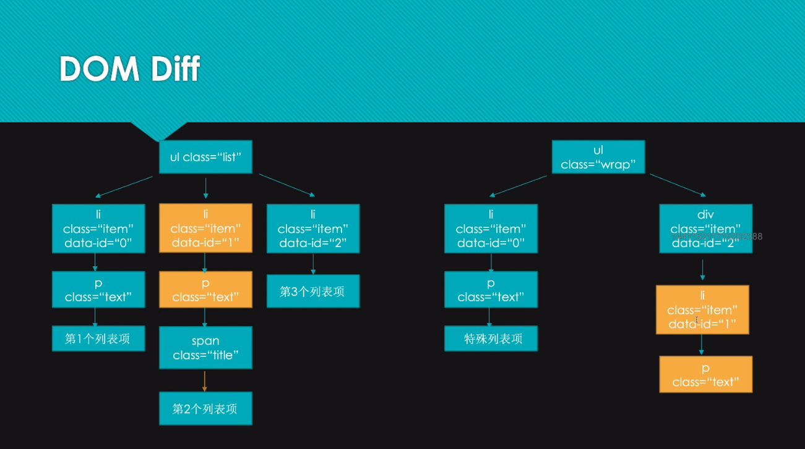
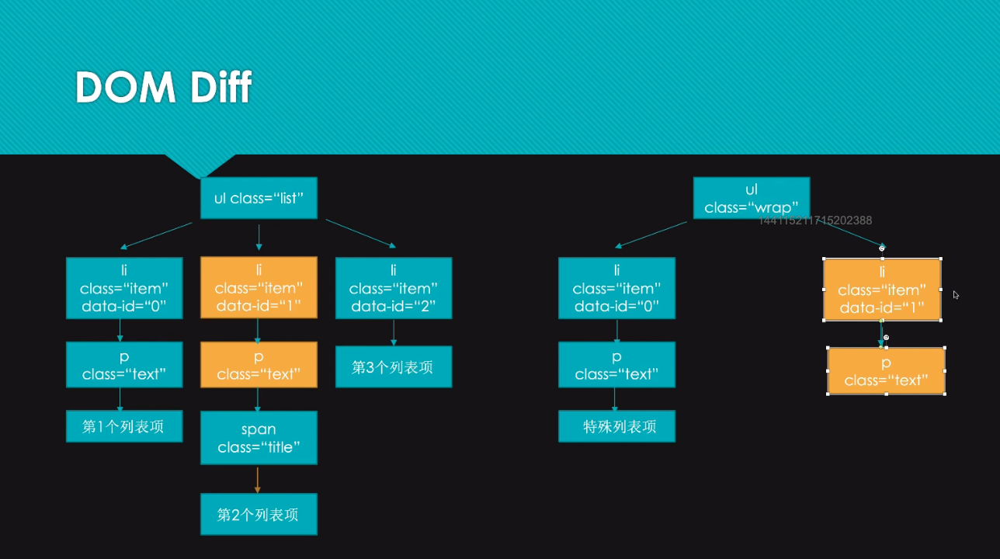
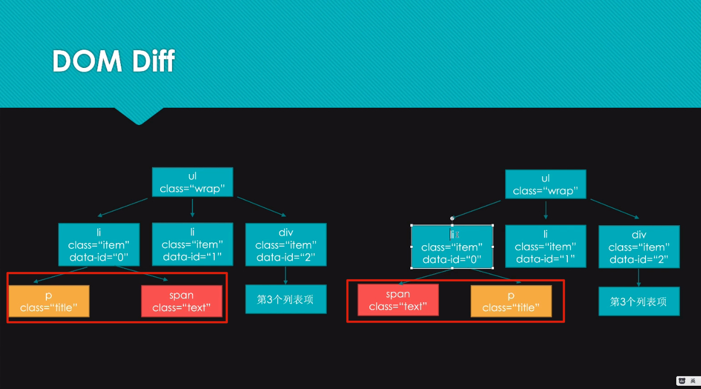
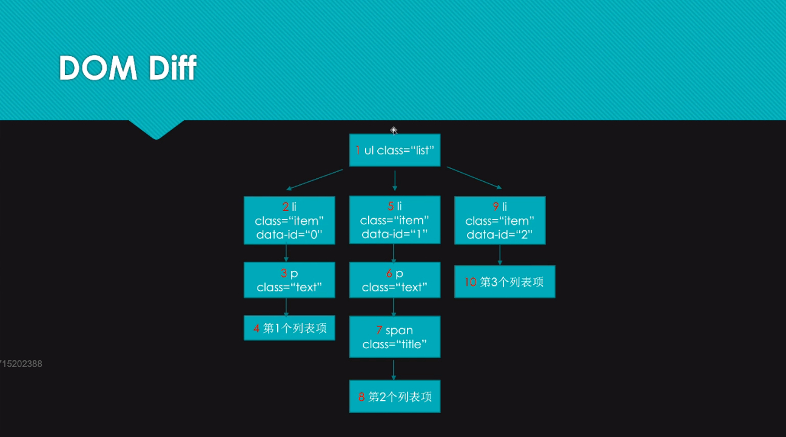
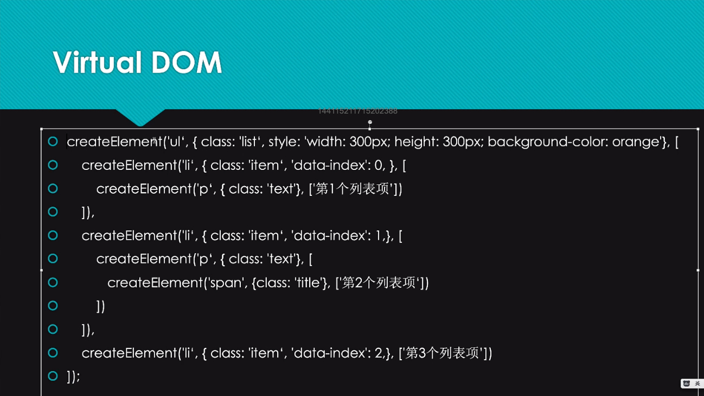
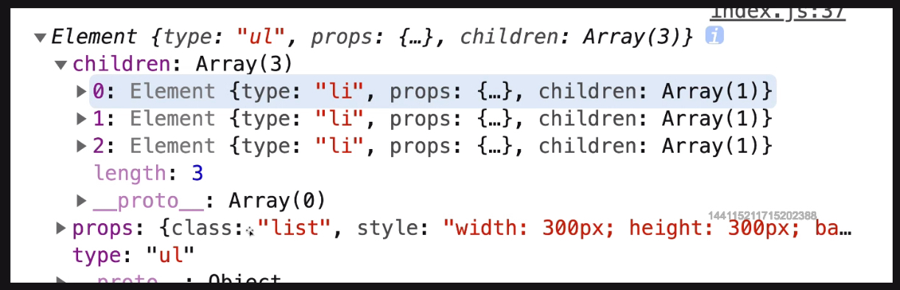

# DOM Diff专题（1）

DOM Diff？

对比两个虚拟节点，找出差异，对应到真实 DOM 上去做打补丁

目的：根据差异以最小代价操作 DOM ，因为操作 DOM 会产生一定的性能

虚拟节点？

理解普通对象，把真实节点通过对象进行描述。

对比是把新的虚拟节点和旧的虚拟节点进行对比，寻找差异，形成一个补丁，然后根据补丁去把真实 DOM 进行匹配。最终目的还是要操作 DOM ，但是是以最小的代价去操作。

无论是 Vue 的 template 还是 React 的 JSX ，都会转换为虚拟节点，更改数据的时候会产生新的虚拟节点，然后就会进行对比，然后打补丁，然后对应真实 DOM 进行修改。

 DOM Diff 算法：

1、具有一定的规则，只会平级一一对应的进行对比，不会跨级对比

同样也是平级对比，如果把右面 li 提升到 上面，就可以进行对比了

2、这时就会按照生成虚拟节点时的标号（索引）进行对比

3、当 DOM 的位置发生变化，是可以进行替换，不需要重新渲染 li 节点

4、DOM Diff 是深度遍历的

走完第一个 li 不是再走平级的 li，而是 li 地下的 p，这是深度优先

如果平级就是广度优先

从下往上进行遍历

这 4 个特点组成 DOM Diff 的算法，算法需要用代码去实现

不是虚拟节点，而是构成虚拟节点代码层面的一种方法。

ul 下的 li 还需要用方法去创建，这是为了把 li 也变成虚拟节点

以上代码，运行完就是这个样子的，构造出来的一个对象，对象内部

模拟实现虚拟 DOM 并渲染到页面，详见 04 文件夹