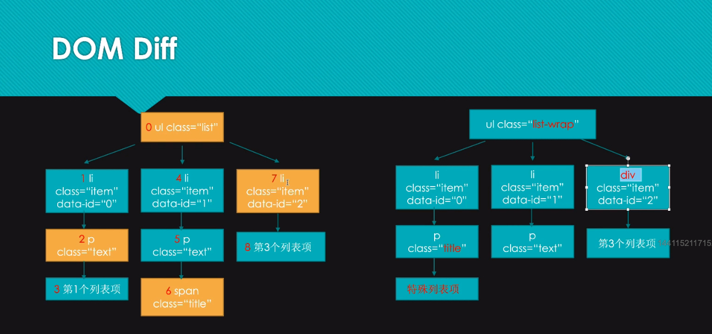

# DOM Diff 专题（2）

把 04_vDom 生成的 DOM 树进行更改，更改内容如下：



模拟一个简单的 patch 对象

```js
const patches = {
  0: [
    {
      type: "ATTR",
      attr: "list-wrap"
    }
  ],
  2: [
    {
      type: "ATTR",
      attr: "title"
    }
  ],
  6: [
    {
      type: "REMOVE",
      index: 6
    }
  ],
  7: [
    {
      type: "REPLACE",
      newNode: {}
    }
  ]
};
```
