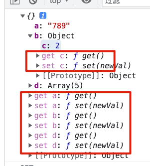

# 【组合式 API】响应式的原理及实现

## Vue2/3 响应式的区别

不是 Vue2 变成了 Vue3，是 Vue2 的主要思想是选项式 API，Vue3 在选项式 API 的基础上新增了组合式 API，拓展了一些函数的 API

函数 API 的好处：可以进行抽离，不必非得现在组件内部，可以写在外面的 JS 文件，完成相关的功能。对封装和集成更加友好。

这就是为什么刚接触觉得有些困难，是因为 Vue2 已经把我们进行了限制，我们只需要在固定的地方书写逻辑，Vue3 更加灵活。而不是想 Vue2 把大量的数据、逻辑都堆在一个文件内部

## Vue2 响应式

是 Vue2 核心，集成了 angular 的思想，响应式就是数据和视图之间的联动关系。说白了数据更改不必要开发者对视图进行驱动，让底层的 Model 帮我们追踪数据依赖的变化，并更新视图的变化

Vue2 是采用定义对象属性：

```js
const obj = {
  a: 1,
  b: 2
};
obj.a = 2;
```

这样定义数据，更改 a 的中间过程希望能 update，让视图放生变化，这样定义啥都干不了

希望更改 a 的时候能 update 视图，只要更改就 update

所以 Vue2 使用 Object.defineProperty 对对象进行了封装对数据进行拦截：

```js
Object.defineProperty(data, "a", {
  // getter 函数
  get() {
    return data.a;
  },
  // setter 函数
  set(newValue) {
    // update()
    data.a = newValue;
  }
});
```

每一个对象的属性都具备定义 getter/setter 的权限。

可以封装一个函数，详见代码！



但是，数组方法无法被劫持到，因为 Object.defineProperty 主要是给对象定义属性的，数组一系列的方法是无法劫持的，只能赋值

```js
data.d = [7, 8, 9];
```

Vue 想出一个办法就是把数组相关的方法全部重写

```js
Array.prototype.push = function (value) {
  this.push(value);
  update();
};
```

劫持：data.d 赋值 ==》 setter 函数负责赋值、update ==》data.d

这就是 Vue2 做响应式的大致流程，也就是数据劫持的过程，劫持的过程中进行数据更新

## Vue3 的响应式

Vue3 用了 ES6 的 Proxy，Vue2 因为兼容性没有使用，当时无法转换为 ES5 的代码，某些浏览器很危险，现在多数浏览器都对 Proxy 进行了支持。

Proxy 和 Object.defineProperty 做的事情很类似，但又不相同

返回一个代理对象

```js
new Proxy(data);
```

详见代码；
