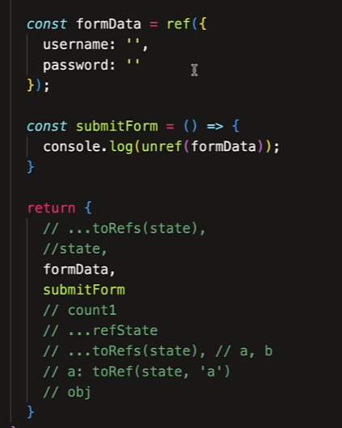

# 【组合式 API】响应式 API 特性(2)

ref() 是针对所有值的定制化的引用包装！保证响应式的同时还可以进行相应的操作和传递。

例如函数传参。

返回 RefImpl 实例对象，referencr implement 引用实现

dep 依赖

\_\_v_isRef 是否是 ref

\_\_v_isShallow 是否是浅响应式

\_rawValue 定义时的值

\_value 当前动态的值

使用 .value 才能拿到值，赋值也是如此

如果判断是不是一个 ref

```js
const count = ref(0);
console.log(count.value);
console.log(isRef(count));
```

如何把一个值转换为一个 ref ？

```js
const state = reactive({
  a: 1
});
const a = toRef(state, "a");
```

toRef() 其实就是对 a 又进行了一层包装

利用 toRefs() 把所有的值进行解构

```js
const data = toRefs(state);
console.log(data);
```

## 自动解包

当 reactive() 响应式数据的属性是一个 ref 的时候，ref 会自动把 .value 拿出来，赋值给 count

```js
const count = ref(0);
const state = reactive({ count });

console.log(count, state.count); // ref， 0
```

虽然进行了解包，但依然是同步的

```js
const count = ref(0);
const state = reactive({ count });

console.log(count, state.count); // ref， 0

setTimeout(() => {
  count.value = 3;

  console.log(count, state.count); // ref， 3
}, 1000);
```

解包只有 Object 有效，数组则不行，需要使用 .value 获取

```js
const count = ref(0);
const state = reactive([count]);

console.log(state[0].value);
```

Ref 值必须是顶层，如果上面还有对象

```js
const obj = {
  count: ref(0)
};
```

```html
<div>{{ obj.count + 1 }}</div>
```

可以进行解构后使用

ref 也是深层的，浅层使用 shallowRef

```js
const obj2 = shallowRef({
  a: 1,
  b: {
    c: 2
  }
});
```

用 ref 包装对象，仍然是通过 reactive 进行了包装，使用 unRef 进行解包，是 .value 的语法糖



如果你想拿到原始的对象，可以使用 toRaw，得到普通的对象