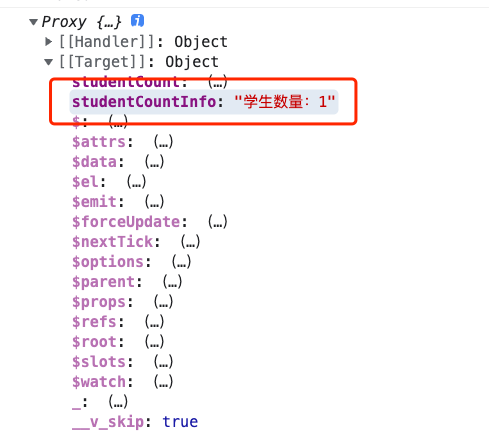
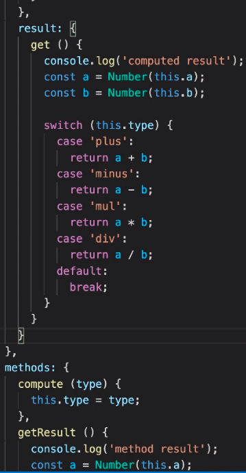

## 计算属性

解决模版中复杂的逻辑运算

逻辑需要被复用

1、模版的逻辑和样式一般尽可能的绝对分离，模版上不做太多的逻辑

2、如果另一个地方要显示同样的逻辑，这样就会导致需要运算两次！

```js
const App = {
  template: `
    <h1>{{ studentCount > 0 ? "学生数量："+ studentCount : "暂无学生" }}</h1>
  `,
  data() {
    return {
      studentCount: 1,
    };
  },
};
```

1、计算属性只会在内部逻辑依赖的数据发生变化的时候才会再次调用

2、计算属性会缓存其依赖的上一次计算出的数据结果

3、多次复用相同值的数据，计算属性只会调用一次

```js
computed: {
    studentCountInfo() {
      console.log("Invoked")
      return this.studentCount > 0 ? "学生数量：" + this.studentCount : "暂无学生";
    },
  },
```



```js
methods:{
    clickBtn(){
      this.studentCount = new Date();
    },
    clickBtn2(){
      this.studentCount = 2
    }
  }
```

##

计算属性可以分离出 get 和 set 机制

```js
computed:{
    sym() { /* 直接调用 get 机制 */},
    result: {
      get() {},
      set() {},
    }
}
```

## methods 和 computed 对比

methods 每次都会执行



## 实现computed与依赖收集
