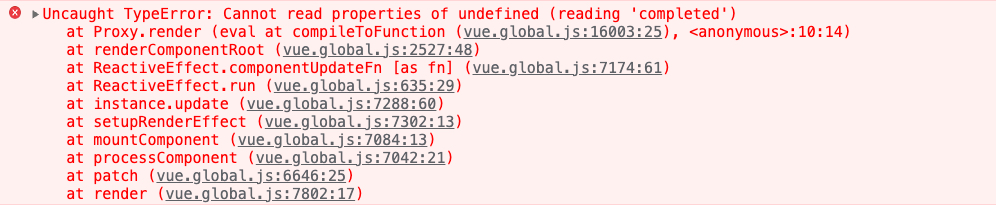

Vue 不推荐在同一个元素上使用 v-if 和 v-for

案例，未完成的时候显示项

```html
<ul>
  <li v-for="(item, index) of todoList" v-if="!item.completed" :key="item.id">
    {{ item.content }}
  </li>
</ul>
```

获取不到 item



图片说明了在渲染期间 item 属性确实被访问，但是 item 并没有定义，所以无法访问

Vue 在进行 v-for 解析的时候，存在优先级的问题, v-if 的优先级高于 v-for

这会导致 v-if 获取不到 item ，所以 v-for 执行的时候才会获取到 item

## 解决方案

如果 v-for 和 v-if 存在同一个元素，那么 v-if 的优先级高于 v-for ，所以我们可以 v-for 用于 template 上

```html
<ul>
  <template v-for="(item, index) of todoList">
    <li v-if="!item.completed" :key="item.id">{{ item.content }}</li>
  </template>
</ul>
```

获取使用 computed 来解决

```js
const app = {
  computed: {
    notCompletedTodoList() {
      return this.todoList.filter((el) => el.completed);
    }
  }
};
```

```html
<ul>
  <li v-for="(item, index) of notCompletedTodoList" :key="item.id">{{ item.content }}</li>
</ul>
```

但是这样的情况是允许的，但是仍然不建议你这么使用

```html
<ul>
  <li v-for="(item, index) of todoList" v-if="todoList.length > 0" :key="item.id">
    {{ item.content }}
  </li>
</ul>
```

推荐把 v-if 加到 ul 元素上

```js
<ul v-if="todoList.length > 0">
    <li v-for="(item, index) of todoList" :key="item.id">{{ item.content }}</li>
</ul>
```

## Vue2

v-for 的优先级比 v-if 的更高

Vue3 为什么把优先级做了更新（作用在同一个元素上的时候）？

1、逻辑层逻辑来看，if 是要大于 for 的，if 决定了是否渲染，for 是决定如何渲染的的问题

2、性能层来看，先判断是否渲染，在判断如何渲染，所带来的性能消耗就会不一样，如果先判断如何渲染，在判断是否渲染那就得重新渲染