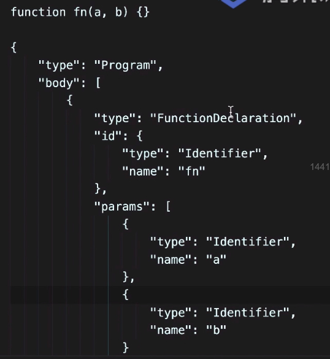

一般 JS 框架不会使用 Webpack 打包，因为这是项目打包方案，里面设计到大量的 CSS、JSX、vue-lader 的处理，Webpack 的打包时间是比较长的

但是 rollup 也是工程打包工具，主要是打包 JS 文件，我们的库文件都是 JS 文件，所以打包的时候要选择 rollup，更专注于打包 rollup

Vue、React 都是是通过 rollup 来打包的

--- 

Vue 解析模版时的优先级：Render > template > el

template > 进行编译 > 产生真实DOM

编译的过程是什么？

1、获取到 template

2、把 template 转换为 AST 树

    AST 基本的概念：

    1、AST 是 （Abstract syntax tree 抽象语法树）的缩写，是源代码的抽象语法结构的树状描述，为什么形成树？可以通过手段改变结构，再形成源代码，比起你直接操作源代码要好得多，通过这个树形机构就表述出了这个函数（图片）；我能不能通过代码改变树形结构呢？改完之后再进行解析产生源代码。

    2、HTML 结构用树形结构进行描述（ast.md），这不是虚拟dom，虚拟dom是描述dom对象的，ast恰巧是描述模拟一个 html 的树形结构，而不是描述 dom 节点的。template 转换为 AST 树是为了解决模版中的 v-* 的指令，这些东西虚拟DOM中不能存在，因为真实 dom 是要真正是别的，v-是不能识别的，所以要用 ast 形成后进行优化，把多余的属性进行解析为功能。

    虚拟 DOM 是描述 dom 节点的，要把虚拟节点转换为真实的 dom，ast 是对源代码层面的一层树结构的展示。

    Webpack：impout -》 reuqire

    ts=》js

    eslint

    都是通过 AST 来实现的

3、AST 形成后必须转换为 render 函数，

    把 AST 转换为 _C _V -S 的一系列的字符串，字符串里有方法，最后转换为真正要渲染的虚拟dom字符串

4、通过 render 函数去转换虚拟节点

5、设置 patch（数据进行变化，进行节点对比），打补丁到真实的 dom

