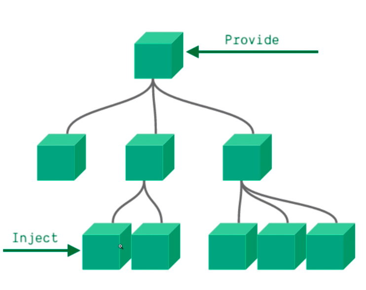

# 02、组件化、Provide与Inject的基本认识

provide 提供

inject 注入

意味通过 provide 在组件内部提供一个别人能够访问的数据，然后 inject 在需要数据的组件内部注入数据。

## 组件化

项目 =》 视图为线索 =》切割为无数的碎片

碎片 =》 组成我们想要的样子和功能

碎片 =》 在其他不同的碎片中进行依赖，最终组合成一个页面交互的整体，这个整体就是组件树

组件A =》 其他任何组件进行依赖 =》 组件形成复用特性

组件A =》 数据来源是依赖组件提供的 =》 形成组件的可配置性

原则上 =》 组件可以无限制的被依赖 =》数据就可以无限极的被传递下去 =》 正常的单向数据流

导致了 =》 数据将穿过所有依赖关系中的组件 =》造成了许多层组件并未使用的数据出现

组件中对属性要进行强制注册，

如何解决？

组件依赖关系要变得简单 =》 组件之间的嵌套关系不能太深 =》组件化设计的时候就要考虑到组件的扁平化

但是某些复杂的项目，嵌套是非常深的，这个时候 provide/inject 就是来解决这个问题的

父组件通过 provide 提供数据，子组件通过 inject 注入数据

但是 provide/inject 也存在很大的弊端：

1、父组件 provide 一个数据，无论哪个层级的子组件通过 inject 注入数据，但是这个数据绑定的时候并不是响应式的！！！

2、父组件是不知道谁使用了 provide 数据，子组件也不知道谁提供了数据

3、所以

    当一个组件体系下，如果有深度嵌套

    Page =》SideBar =》List =》Item =》Link
    index（provide）-----------------》inject

    当一个组件体系下，多层级多个组件使用的时候

    TodoList =》TodoFooter =》TodoStastics
    todoList => todos --------》Item(inject)
    todoList => len --------》len(inject)

