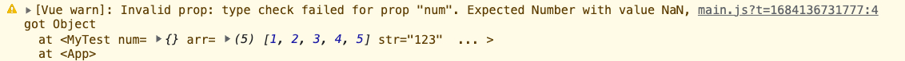

# 【props】深入 props 的应用

props 有多少原生类型 JS 构造函数:

String Number Boolean Array Object Date Function Symbol Promise

也接受自定义的构造函数

props 也接受默认值：

```js
export default {
  props: {
    num: {
      type: Number,
      default: 100
    },
    arr: Array,
    str: String,
    bool: Boolean,
    obj: Object,
    setNum: Function,
    a: Number,
    b: Number,
    demo: Demo
  }
};
```

props 的书写并没有特别严格的规范，但是有种 Vue 推荐的写法，使用组件的时候属性的传递用 - 进行分割（符合 XHTML 的规范），

```html
<my-test :num="num" :arr="arr" :str="str" :set-num="setNum" />
```

在字符串模版中使用 setNum 时候也不会报错并没有那么严格，但是我们的模版都是标准的 Web Components 标准，它本身也是要符合 XHTML 规范的，所以推荐使用 - 进行分割，在子组件注册的时候就可用使用驼峰的形式

```js
export default {
  props: {
    setNum: {
      type: Function
    }
  }
};
```

如果传递的 props 不是特定的类型，将会产生警告：

```html
<my-test :num="{}" :arr="arr" :str="str" />
```



类型定义不会产生报错事因为方便开发者检查传入的类型是否符合要求！

props 也可以传递一个类型校验：

```js
props: {
    title: String,
    isRecom: Boolean,
    status: [String, Number],
    author: Object,
    content: String,
    commentCount: Number,
    comments: Array
  }
```
