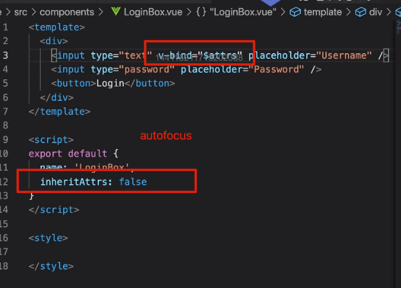

# attributes 传递与继承

什么是 attributes ?

```html
<div id="app" class="box"></div>
```

这都是 attrbutes!

如何利用在组件上传递 attrbutes 让子组件能够获取并使用它们？（非 props 的 attrbutes）

```html
<my-test a="1" />
```

```html
<div a="1"></div>
```

单个的根元素，使用组件时传递的所有属性都会增加到根元素上

```html
<template>
  <my-selector :value="selectorValue" mode="123" />
</template>
```

```html
<!-- <select value="3" mode="123"> -->
<template>
  <select>
    <option value="1">选项1</option>
    <option value="2">选项2</option>
    <option value="3">选项3</option>
  </select>
</template>
```

我们可以通过 this.$attrs 打印：

```js
 created(){
    console.log(this.$attrs)
  }
```

当传递一个属性的时候，子组件不通过 props 注册，就会挂在到 $attrs 上！

## 禁用 attrs

这种继承是可以禁用的

```js
export default {
  name: "MySelector",
  inheritAttrs: false, // 禁用继承属性
  created() {
    console.log(this.$attrs); // 虽然可以打印出来，但是元素上不会挂载
  }
};
```

你可以手动的去挂载

```html
<select v-bind="$attrs">
    <option value="1">选项1</option>
    <option value="2">选项2</option>
    <option value="3">选项3</option>
  </select>
```

这种情况适合用我们不想挂载到根元素的时候使用



不过我们应该减少 $attrs 的使用，我们应该使用 prosp/emit 去符合数据流的规范