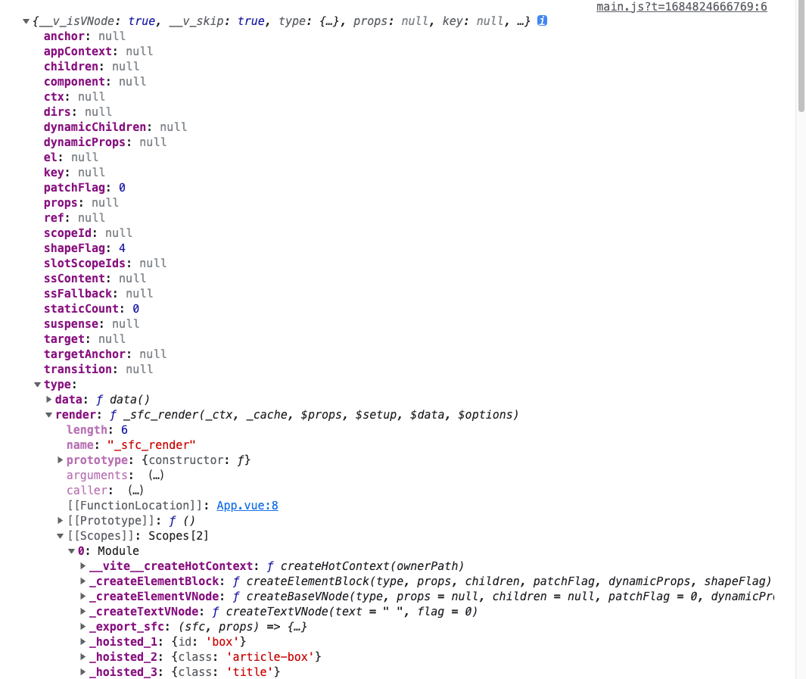

# 编译过程、渲染函数与 h 函数

渲染函数也称为 render 函数，

作用：就是把虚拟 DOM 转换为真实 DOM 的渲染行为

从组件或模版中怎么一步一步变为真实 DOM 的？

例如如下结构的解析过程：

```vue
<template>
  <div id="box">
    <div class="article-box">
      <h1 class="title">{{ title }}</h1>
      <p>
        <span>{{ author }}</span> - <span>{{ dateTime }}</span>
      </p>
      <p class="content">{{ content }}</p>
    </div>
  </div>
</template>
```

组件 -- 提取模版（字符串） -- 编译模版 -- AST

字符串如何转换为真实 DOM 呢？

1、模版不只有 HTML 认识的东西也有不认识的东西（v-if）,浏览器无法解析这些属性，需要有一种方式把这些属性优化调，所以需要把这个字符串转换为 AST 树（模版编译课），AST 是一种自定义的语法树，然后需要把 AST 树进行优化，说白了就是把浏览器不认识的东西都转换为对应的逻辑（v-if、v-model）要把 JS 实现为一种逻辑，且去除这些东西！就剩下一些浏览器能解析的东西

「链接上面」 -- 编译为虚拟 DOM（对真实 DOM 的一种描述）

```html
<span>123</span> span.innerText = 123
```

从逻辑角度来说，这肯定会进行更新，但其实没有必要。

所以我们可以进行对比判断是否需要更新

```js
span.innerText !== "123" && (span.innerText = "123");
```

但是我们需要去获取 DOM 节点

我们可以通过虚拟 DOM 去描述这个 DOM

```js
{
    tag: 'span',
    attrs: {},
    children: "123"
}
```

这样我们直接去和虚拟 DOM 进行对比

再比如

```html
<span>
  <span>
    123
    <span>234</span>
  </span>
</span>
```

```js
span.innerText = (
  <span>
    123 <span>345</span>
  </span>
);
```

但是 123 并没有进行更改，如果不使用虚拟 DOM 就把整个 span 都进行更新

而虚拟 DOM 会继续逐一对比，只会更新发送变化的 DOM

这就是虚拟 DOM 的好处，虚拟 DOM 是为了尽最大的能力去减少对 DOM 的操作

虚拟 DOM -- patch(转换为渲染函数) -- 真实 DOM

当数据发生变化的时候，虚拟 DOM 对比 -- 打补丁 patch（对比的结果） -- 更新真实 DOM

> dom diff 算法会把 DOM 进行对比，然后形成 patch 对象，记录了新旧 DOM 的差异，然后根据 patch 对象去更新 DOM

---

```js
new Vue({
    render: (h) {
        return h(App)
    }
})
```

这个 h 函数是什么？

h 函数能做什么？

h 函数准确的来说应该是 createNodeDescrition，创建节点描述

所以就是创建 vNode (Virtual Node) 虚拟节点，多个虚拟节点就会组成虚拟 DOM 树，虚拟DOM就是对真实 DOM 的描述

虚拟节点就是对真实节点的描述，

h 函数的返回对真实节点的描述

参数：

component 组件：对组件进行分析，所以上面说到的 组件 -- 字符串 -- 编译模版 -- AST 树 -- 优化 -- 虚拟节点 就是 h 函数的任务

节点的描述：非虚拟节点，而是你对节点的描述

```js
import { createApp, h } from "vue";
import App from "./App.vue";

// createApp(App).mount("#app");

console.log(h(App)); // 返回 vNode

createApp({
  render() {
    return h(App);
  }
});

```



如何使用 h 函数描述一段 DOM 内容？

h('tagName', { atrrs }, [children])

只有是元素节点，必须使用 h 函数进行包裹！！！

返回一个虚拟节点！

---


```js
import { createApp, h } from "vue";

createApp({
  data() {
    return {
      title: "This is title.",
      author: "Xiechen",
      dateTime: "2023/05/23",
      content: "This is content."
    };
  },
  render() {
    return h(
      "div",
      {
        id: "box"
      },
      h(
        "div",
        {
          class: "article-box"
        },
        [
          h(
            "h1",
            {
              class: "title"
            },
            this.title
          ),
          h("p", null, [
            this.author + "-",
            h("span", { class: "date-time" }, this.dateTime)
          ]),
          h("p", { class: "content" }, this.content)
        ]
      )
    );
  }
}).mount("#app");
```

我们在 template 中写的任何东西都可以用 h 函数来表达，h 函数不是虚拟节点，而是开发层面对虚拟节点的一种描述！也就是对 template 的描述，h 函数返回一个虚拟节点对象，然后组合为虚拟节点书，组成成虚拟 DOM 树

在单文件组件中，template 和 render 是互斥的，只能选择一个来描述你的视图！