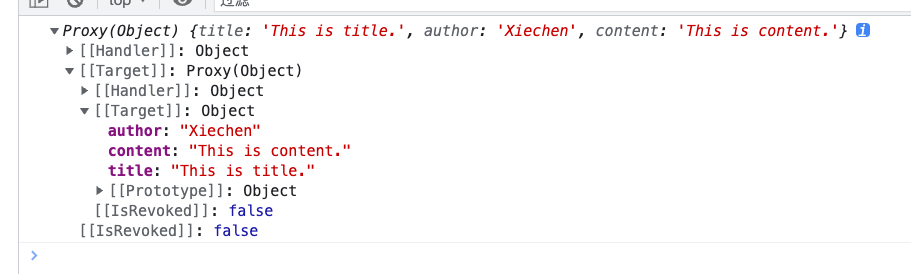
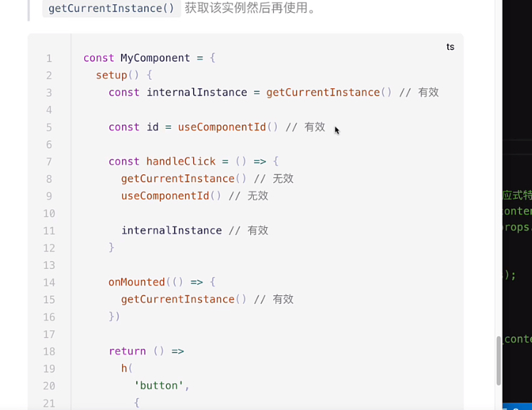
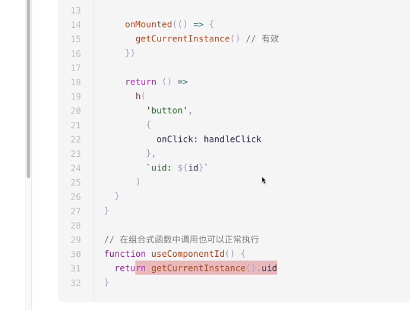

# 深入学习 setup 函数

## setup

组合式 API 的入口函数，所有组合式 API 都可以放入到 setup 函数内部执行。

当组件被创建之前，也就是 beforCreate， 到 props 被解析之后执行，然后再执行 created

所以使用组合 API 的时候，没有 beforCreate 和 created 生命周期函数，都是用 setup 代替。

在组件创建之前执行。

```js
setup(props, context){
    // ...
}
```

## props

props: 就是选项 API 中的 props 的引用

context: 包含一些原本 this 上的一些东西，有 attrs(this.$attrs)，slots（this.$slots）,emit(this.$emit)、expose(Vue3 新增的，暴露属性给父组件)

Vue3 没有完全去除选项 API 而是新增了组合式 API，开发者可以完全不用选项 API

```js
setup(props, { attrs, slots, emit, expose }) {
    console.log(props)
}
```



props 是一个响应式对象，但是不要进行解构，因为会丢失响应式特性

```js
setup(props, { attrs, slots, emit, expose }) {
    console.log(props);

    const { title, author, content } = props;
    console.log(title, author, content);
  }
```

举例更改 content 的案例。

这就代表响应式会丢失

如果你非要进行解构，可以通过 toRefs 让 props 的所有属性全部变成响应式的内容

```js
setup(props, { attrs, slots, emit, expose }) {
    const { title, author, content } = toRefs(props);
    const myContent = computed(() => "Content:" + content.value);

    return {
      myContent
    };
  }
```

如果你只想单独解构一个属性，那么可以使用 toRef 把 content 进行解构

```js
setup(props, { attrs, slots, emit, expose }) {
    const _content = toRef(props, "content");
    const myContent = computed(() => "Content:" + _content.value);

    return {
      myContent
    };
  }
```

## context

context 里面包括 attrs、emit、slots、expose

分别对应：

attrs ==> this.$attrs

emit ==> this.$emit

slots ==> this.$slots

以上 3 个对象是响应式的，但里面的属性都是非响应式的

attrs.xxx 、slots.xxx 是非响应式的

和 props 一样，不要进行解构 attrs、slots 的属性。

在 setup 函数中无法访问 data 中的数据，包括 data、computed、methods

因为 setup 中不存在 this 对象

为什么无法用 this？

1、因为 setup 是在组件创建之前执行的，执行期还没有组件实例，所以就没有 this

2、所以，vue3 会把一些数据放到 context 对象中

3、组合式 API 都是一个个的函数，并不是挂载到组件上，所以并不需要组件的实例，也就是 this 全部通过组合式 API 来操作

## expose

expose 是什么？

expose 意为向外展示...

setup 中 return 的不一定是一个对象供视图使用，万一是一个 h 函数或者 jsx 呢

这种情况下，就无法向外暴露更多的东西了。

```js
setup(props, context) {

    context.expose({
        test:()=>console.log("test")
    })

    return () =>
      h("div", null, [
        h("h1", null, context.slots.default()),
        h("p", null, context.slots.author()),
        h("p", null, context.slots.content())
      ]);
  }
```

父组件获取 ref

```js
setup() {
    const VSetupRef = ref(null);

    onMounted(() => {
      console.log(VSetupRef.value);
      VSetupRef.value.test(); // 正常执行
    });

    return {
      VSetupRef
    };
  },
```

当不 return h 函数的时候，父组件可以拿到 setup return 的值

所以 expose 是为了当返回 h 函数或者 jsx 的时候，暴露出值

Vue3 可以通过 getCurrentInstance() 函数来获取当前组件的实例

不建议在应用代码中使用，也不建议使用 getCurrentInstance() 来代替 this 对象

getCurrentInstance() 只能在 setup 和生命周期钩子函数中调用



