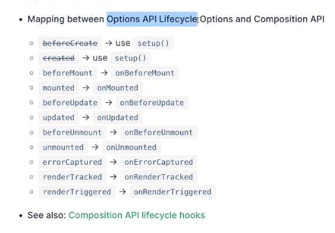

# 【组合式 API】深入学习 Vue 的生命周期

## Vue2.0 版本

new Vue()

    初始化一些事件，生命周期

beforeCreate()

    初始化注入、初始化响应式数据（例如 data）

created()

    模版编译

    有没有 el 属性？

        有：交给 vm.$mount(el) 去处理

        没有：

            有没有 template 模版？

                有：直接去编译模版，转换为 render 函数

                没有：找 el 的 outerHTML 作为 template

    所有 template 最终都是要存在的，不是是在选项中就是 index.html 的 <div id="app"></div> 中存在，把 id="app" 获取到

```js
new Vue({
  el: "#app",
  data: {
    a: 1
  },
  created: function () {
    console.log('a is: ' + this.a)
  }
})
// 如果上面这段代码没有 el 会是使用 $mount()
new Vue({
  data: {
    a: 1
  },
  created: function () {
    console.log('a is: ' + this.a)
  }
}).$mount("#app")
```

beforeMount()

    创建 vm.$el 且替换 el，模版编译（template==AST==vNode==rNode）

mounted()

    挂载节点

beforeUpdate()

    虚拟 DOM 重新渲染和打补丁

updated()

    当组件开始卸载

beforeDestory()

    卸载监听器、子组件和事件处理

destoryed()

    组件卸载

## Vue3 版本

生命周期在 Vue2 都是选项 API 的形式，Vue3 是组合式

```js
import { onMounted } from "vue";

export default {
  setup() {
    onMounted(() => {
      console.log("onMounted");
    });
  }
};
```

生命周期函数只能同步的使用在 setup() 函数内部，因为他们都依赖内部全局状态定外到当前的实例上

如果你并不是在当前组件的实例上（setup 执行期间所产生的组件实例）的情况下使用，会导致一个错误

在生命周期同步执行的时候，组件的实例上下文也会被设置；

监听器和计算属性也会被创建，在生命周期函数的

组件卸载的时候，监听器和计算属性也会自动的卸掉。

选项 API 和组合 API 生命周期对比：



beforeCreate 和 created 不存在，而是使用 setup 来代替

- setup 类似一个程序的入口

- beforeMount 被 onBeforeMount 替代

watchEffect 默认会先比 onBeforeUpdate 执行，可以设置比 onBeforeUpdate 后执行

```js
watchEffect(
  () => {
    console.log(">>>>watchEffect");
  },
  {
    flush: "post"
  }
);
```

onErrorCaptured 会在子孙组件内部发生错误的时候进行捕获错误

```js
onErrorCaptured((e) => {
  console.log(e);
});
```

```js
// 当组件渲染的时候会执行，可以进行 debugger 调试
onRenderTracked((e) => {
  // debugger
});

// 和 onRenderTracked 一样，但是是在重新渲染的时候执行
onRenderTriggered((e) => {});
```
