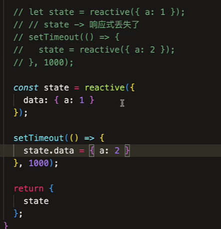

# 【组合式 API】响应式 API 特性(1)

## reactive()

reactive() 是深层次的响应式

```js
const data = {
  a: 1,
  b: {
    c: 2
  }
};

const state = reactive(data);
```

代理对象和源对象不是同一个引用

```js
console.log(state === reactive(state));
```

reactive() 包装过的对象再次被包装，会返回第一次被包装的代理对象

也就是说无论包装多少次都会返回 state ，相同的引用

```js
console.log(isReactive(state));
```

通过 isReactive() 来判断是不是 reactive 包装的对象

## shallowReactive()

和 reactive() 相反，它是浅层的响应式包装

```js
const data = {
  a: 1,
  b: {
    c: 2
  }
};

const state = shallowReactive(data);
console.log(isReactive(state));
console.log(isReactive(state.b));
```

只有第一层数据是响应式的

reactive() 的缺陷：

1、只针对 Array Map Set Object 有效，无法包装原始值。因为 JS 没有针对任何值有一个处理的方式，没有办法让原始值也拥有引用的属性，这样就得去包装一层

2、不能复制为一个新的对象，会丢失响应式



3、不能把属性进行解构，也会丢失响应式

因为你把对象的属性解构出来，就单纯的拿到了属性的值，不会再触发拦截的 set/get 机制

也不能作为函数的参数进行传递

所以 ref 就诞生了，就是为了解决所有值统一有引用的操作模型。