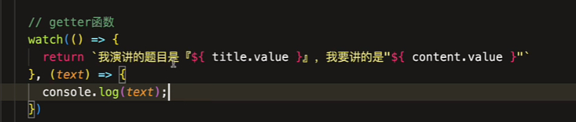

# 【组合式 API】侦听器的基本认知

侦听器？

用于侦听依赖数据，依赖就是响应式数据，当数据变更的时候要能侦听到这个变化，从而提供给开发者一个 API 接口回调完成接下来的自定义任务。

```js
function test(a, b, callback) {
  const result = a + b;
  // 完成任务
  callback(result);
}
```

这就是一个函数接口，函数让我们能拿到计算的结果。

Vue 中的 watch() 就是这么一个接口。

watch()

参数 1: 响应式数据

参数 2: 回调函数

主要是侦听一个值的数据变化，可以获取到改变前和改变后的值

```js
watch(title, (newVal, oldVal) => {
  console.log(newVal, oldVal);
});
```

回调函数是开发者去实现自己的程序逻辑。

说白了，就是依赖变化了马上执行回调函数。

watch() 不仅可以接受单独的 Ref 值，在 watch() 都认为是 source 数据源

还可以接受一个 getter 函数



当某一个值发生变化的时候，watch() 会重新执行该函数返回一个结果，交给 callback 函数。

如果两个值同时发生了变化，回调只会执行一次！！！

当一次性更改两个值的时候，watch() 会收集依赖，缓存回调的执行，合并为一次来操作。

折和 computed() 依赖收集很类似。