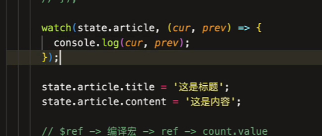
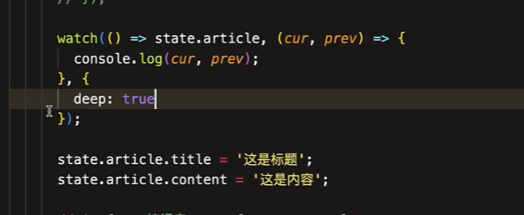
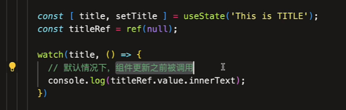

# 【组合式 API】watch 的应用

你不能直接把 reactive 的对象属性传递给 watch() 函数，因为这样数据不是响应式的

这和 reactive 对象属性不能解构使用时一样的道理

```js
watch(state.age, (newVal) => {
  console.log(newVal);
});
```

可以改写为一个函数（getter 函数）

```js
watch(
  () => state.age,
  (newVal) => {
    console.log(newVal);
  }
);
```

当值变化的时候，函数会作为变化侦听的依赖，把函数作为一个引用。

函数执行返回一个执行的形式来标识 state.name 而不是它的值。

依赖必须是一个对象！！！

state.name 是一个原始值，是不可变的，无法被侦听

如果你想被侦听，一定要是一个对象，这样才能进行获取属性的变化



如果直接侦听一个对象的值，那么它是深度的，对象内属性的变更是可以被侦听到的

如果是一个 getter 函数（getter 函数是非深度的），当 article 内属性发生变化的时候是侦听不到的，你需要进行深度侦听



watch() 还可以加接受一个数组

```js
  setup() {
    const [title] = useState("This is title.");
    const [state] = useReactive({ name: "张三", age: 20 });

    watch([title, () => state.name], (newVal, oldVal) => {
      console.log(newVal, oldVal);
    });

    setTimeout(() => {
      title.value = "这是标题。";
      state.name = "李四";
    }, 1000);
  }
```



watch() 一定会拿到 DOM

但是这个值是组件更新之前的值，所以默认情况下 watch() 执行回调是在组件更新之前被调用。

如果你想拿到更新之后的值，可以使用 flush 进行配置

```js
watch(ttile, (newVal, oldVal) => {}, {
  flush: "post"
});
```

这个时候回调函数是在组件更新之后执行的！

如果你在创建 watch 的时候立即执行可以使用 immediate: true

```js
watch(ttile, (newVal, oldVal) => {}, {
  immediate: true
});
```

这会在组件创建后，watch 定义时立即执行

如果你想深度侦听，可以使用 deep: true

```js
watch(object, (newVal, oldVal) => {}, {
  deep: true
});
```

这样不仅可以侦听 object 本身也可以侦听 object 下面的属性

```js
watch(
      title,
      (newVal, oldVal) => {
        console.log(newVal, oldVal);
      },
      {
        onTrack: (e) => {
          console.log(e);
        },
        onTrigger: (e) => {
          console.log(e);
        }
      }
    );
```

onTrack 会在当依赖被追踪调用的时候执行

onTrigger 会在依赖修改的时候被执行